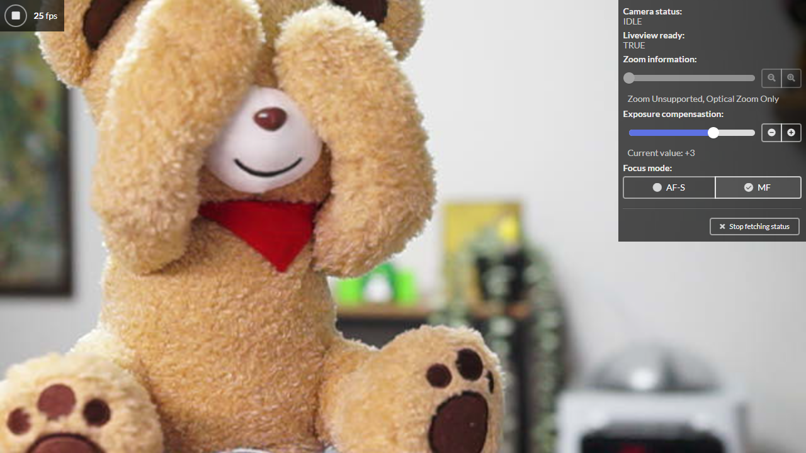

### node-sonycam-example-socketio

This repository contains a web-based client implementation for [Sony Camera Remote API beta](https://developer.sony.com/develop/cameras/) using [Next.js](https://nextjs.org/) (bootstrapped with [`create-next-app`](https://github.com/vercel/next.js/tree/canary/packages/create-next-app)), [Socket.io](https://socket.io/), and [Fomantic-UI](https://fomantic-ui.com/). Use of the Camera Remote API is wrapped by a separate Node.js library [node-sonycam](https://github.com/arcatdmz/node-sonycam).

このリポジトリには [Sony Camera Remote API beta](https://developer.sony.com/develop/cameras/) の Web クライアント実装が含まれています。 [Next.js](https://nextjs.org/) (bootstrapped with [`create-next-app`](https://github.com/vercel/next.js/tree/canary/packages/create-next-app)), [Socket.io](https://socket.io/), [Fomantic-UI](https://fomantic-ui.com/) を使って開発されています。 Camera Remote API の呼び出しは別リポジトリの Node.js 用ライブラリ [node-sonycam](https://github.com/arcatdmz/node-sonycam) でラップされています。



### Usage / 使い方

First, install dependencies and run the development server:

まず依存ライブラリをインストールしてから開発サーバを起動してください:

```bash
npm i
npm run dev
# or
yarn
yarn dev
```

Open [http://localhost:3000](http://localhost:3000) with your browser to start controlling your camera. Open [http://localhost:3000/view](http://localhost:3000/view) to see live preview without control UIs.

[http://localhost:3000](http://localhost:3000) をブラウザで開いてカメラ操作を開始してください。 [http://localhost:3000/view](http://localhost:3000/view) を開くと操作用ユーザインタフェースを除いたライブプレビューのみを閲覧できます。

### Credits / 開発者

- [Jun Kato](https://junkato.jp)

---

Copyright (c) 2022 Jun Kato. Released under the [MIT license](https://opensource.org/licenses/MIT).
